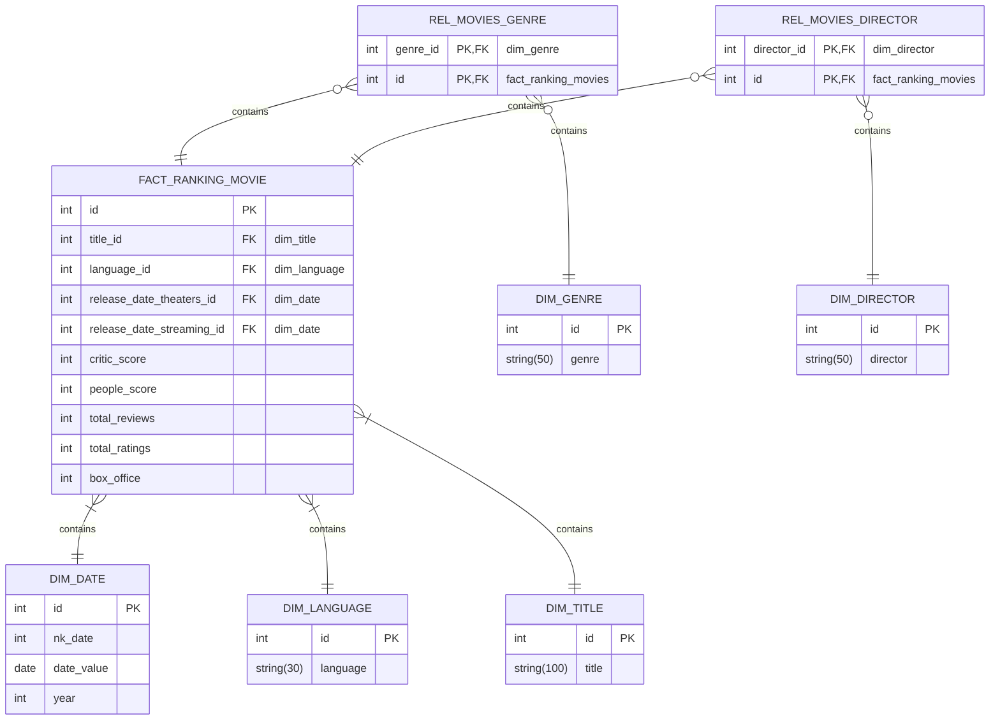

# Data Warehouse Project - Rotten Tomatoes Movie Data

This README provides an overview of a data warehouse project involving the collection, transformation, modeling, and visualization of movie data from Rotten Tomatoes. The project includes the use of a CSV database obtained from Kaggle, the implementation of a star schema in a SQL Server database, and the creation of a dashboard using Power BI.

## Project Overview
The goal of this project is to create a data warehouse that enables efficient analysis and reporting on movie data from Rotten Tomatoes. The process involves several steps, including data collection, data transformation, database modeling, and data visualization.

## Data Collection
The initial step of the project involves obtaining the movie data. For this project, a CSV database from Rotten Tomatoes was sourced from [Kaggle](https://www.kaggle.com/datasets/thedevastator/rotten-tomatoes-top-movies-ratings-and-technical). The database contains information such as movie titles, ratings, genres, release dates, and other relevant attributes.

## Data Transformation
After acquiring the CSV database, it needs to be transformed to fit the desired data warehouse structure. This transformation process typically involves data cleansing, filtering, and formatting. The CSV file is processed to ensure consistency, remove any inconsistencies or errors, and prepare the data for loading into the SQL Server database.

## Database Modeling
In order to optimize querying and analysis, a star schema is implemented in a SQL Server database. The star schema consists of a fact table that holds the key metrics and measures related to movies, such as ratings and box office performance, and dimension tables that contain descriptive attributes like movie title, genre, release year, and more. This schema facilitates efficient and simplified data retrieval.

## SQL Server Database
The transformed and modeled data is then loaded into a SQL Server database. SQL Server provides robust data management capabilities and is commonly used for data warehousing projects. The database is designed to support high-performance querying and reporting, enabling efficient analysis of the movie data.

## Data Visualization - Power BI Dashboard
To provide intuitive and interactive data visualization, a Power BI dashboard is created using the SQL Server database as the data source. Power BI offers powerful visualization and reporting capabilities, allowing users to explore the movie data through various charts, graphs, and interactive elements. The dashboard can be customized to display key metrics, trends, and insights related to movies, enabling stakeholders to make data-driven decisions.
